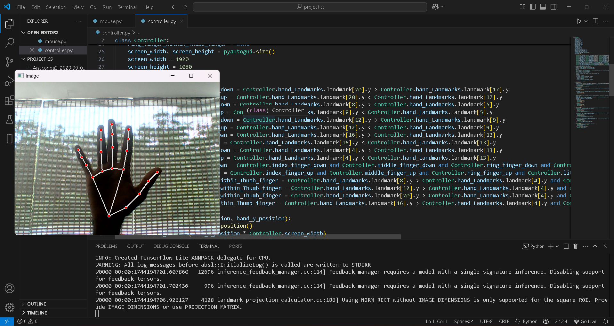

# ✋ AI Virtual Mouse Controller using Hand Gestures

This project uses computer vision and hand tracking to turn your hand into a virtual mouse! With just a webcam and your hand, you can move the cursor, click, scroll, drag, and even zoom — completely touch-free.



---

## 🚀 Features

- 📹 Real-time hand tracking using MediaPipe
- 🖱️ Move cursor with index finger
- 👆 Click, right-click, and double-click using finger gestures
- 🖱️ Drag and drop using all fingers
- 🔍 Zoom in/out using pinch gestures
- 🔃 Scroll using specific finger poses

---

## 🛠️ Built With

- [Python 3](https://www.python.org/)
- [MediaPipe](https://google.github.io/mediapipe/)
- [OpenCV](https://opencv.org/)
- [PyAutoGUI](https://pyautogui.readthedocs.io/en/latest/)

---

## 📁 Project Structure

```
.
├── mouse.py            # Main app for virtual mouse
├── controller.py       # Gesture controller logic
├── image.png           # Screenshot of app in action
```

---

## ⚙️ How to Run

1. **Clone the repository:**

   ```bash
   git clone https://github.com/yourusername/virtual-mouse.git
   cd virtual-mouse
   ```

2. **Install the required packages:**

   ```bash
   pip install opencv-python mediapipe pyautogui
   ```

3. **Run the application:**

   ```bash
   python mouse.py
   ```

4. **Grant screen control permission** (if needed, especially on macOS).

---

## 🎯 Gestures Guide

| Gesture                            | Action             |
|------------------------------------|--------------------|
| Index finger up                    | Move cursor        |
| Index + Thumb pinch                | Left click         |
| Middle + Thumb pinch               | Right click        |
| Ring + Thumb pinch                 | Double click       |
| All fingers down                   | Drag               |
| Index up + Thumb down              | Freeze cursor      |
| Index down + Pinky up              | Scroll up/down     |
| Pinch index + middle fingers       | Zoom in/out        |

---

## 📸 Screenshot


---

## 🤝 Contributing

Pull requests are welcome! If you'd like to improve gesture detection or add more features, feel free to fork and contribute.

---

## 📄 License

This project is licensed under the **MIT License** — see the [LICENSE](LICENSE) file for details.

---

## 💡 Credits

- Powered by [Google MediaPipe](https://google.github.io/mediapipe/)
- Inspired by human-computer interaction via gestures
